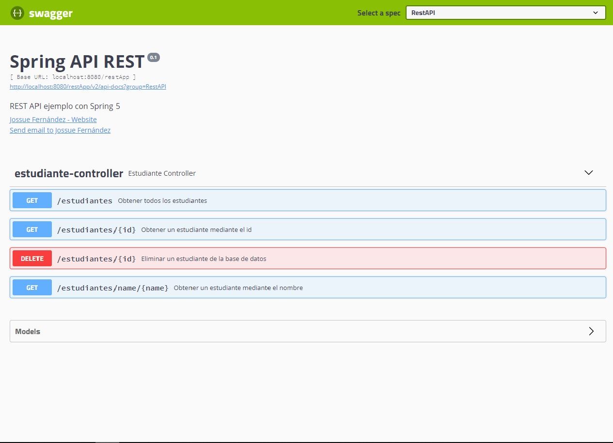

# Spring Rest API

Ejemplo de un API Rest usando usando Spring MVC 5, Spring Data, Spring Platform, Hibernate, Swagger_2 y Lombok.

---

# El proyecto permite utilizar un pequeño CRUD para la definicion de un estudiante

- Las propiedades para la conexion a la base de datos se encuentran en el archivo 'persistance.properties'

- El endpoint es: http//:localhost:8080/restApp

- Es necesario instalar Lombok Project para poder hacer uso de sus librerias.

- Use Swagger para documentar mi servicio Rest, asi como la interfaz de usuario swagger-ui disponible en http://localhost:8080/restApp/swagger-ui.html

